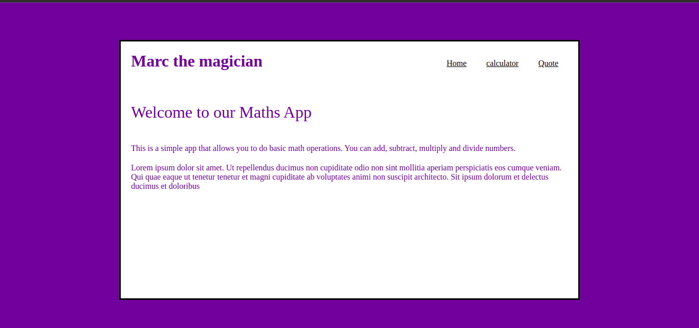
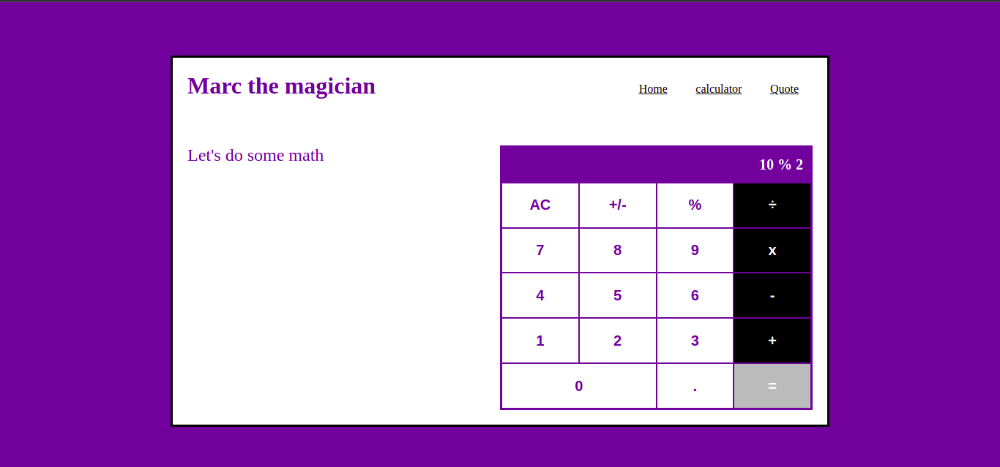
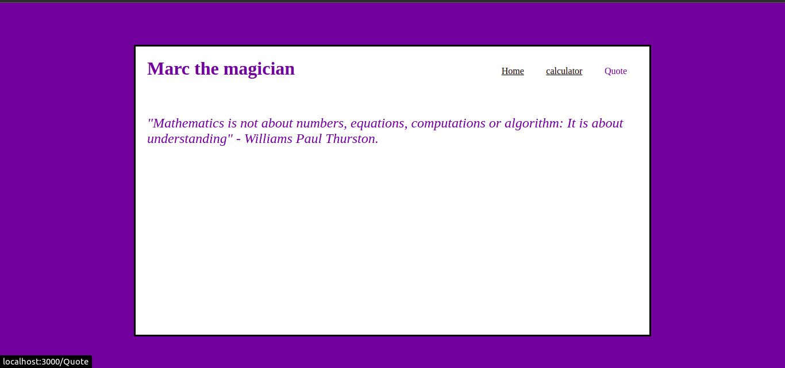

# Math Magicians

> A calculator website following the Single Page Application process, build with REACT

Additional description about the project and its features.

## Built With

- Major languages: JavaScript REACT, HTML&CSS
- Frameworks
- Technologies used

## Live Demo

[Live Demo Link](https://livedemo.com)

## Getting Started

**This is an example of how you may give instructions on setting up your project locally.**
**Modify this file to match your project, remove sections that don't apply. For example: delete the testing section if the currect project doesn't require testing.**

To get a local copy up and running follow these simple example steps.

### Prerequisites
npm/yarn installed

### Setup
clone the repo: <code>git clone git@github.com:Marcraphael12/Marc-the-magician.git</code> 
jump to the active branch: <code>git checkout setup-react</code> 
### Install
in the terminal, run: <code>npm install</code> or <code>npm i</code>
### Usage
now run <code>npm start</code> to start the app
### Run tests
Author only
### Deployment
In progress

## Authors

👤 **Marc Raphael**

- GitHub: [@githubhandle](https://github.com/githubhandle)
- Twitter: [@twitterhandle](https://twitter.com/twitterhandle)
- LinkedIn: [LinkedIn](https://linkedin.com/in/linkedinhandle)

## 🤝 Contributing

Contributions, issues, and feature requests are welcome!

Feel free to check the [issues page](../../issues/).

## Show your support

Give a ⭐️ if you like this project!

## Acknowledgments

- Hat tip to anyone whose code was used
- Inspiration
- etc

## 📝 License

This project is [MIT](./MIT.md) licensed.
